

(12,4) (0,1.8)

**U-Net based ZO-1 image processing for advanced immunofluorescence
analysis - end user documentation**

Revision 2.0 11.03.2025  Author: Johannes Jahn
johannes.jahn@uniklinik-freiburg.de

# 1. Introduction

Based on the idea to compute unbiased measurements for
immunofluorescence images a multi-step image processing pipeline was
developed. This system replaced the error-prone and time-consuming
analysis by hand that couldn’t provide numerical values for the image
characteristics. The methods can be used to evaluate immunofluorescence
images stained with antibodies against ZO-1. This documentation should
serve as a step-by-step instruction to process and analyze own
image-datasets. For more detailed information of the methods and the
theoretical background please have a look publication and the source
code.

To better understand the whole system the following text gives brief
explanations about the individual processing steps. First, the image
capturing takes place. The previously stained microscope preparations
are captured and saved as individual files. The second step is the image
segmentation using a U-Net deep learning network. This step is executed
in ImageJ/Fiji and detects the relevant image components. The third and
fourth step are run in Mathematica. It performs the modeling algorithms
and the measuring of the image components. Afterwards, the images can be
divided into individual groups (e.g. genotype or different treatment)
and the gathered data is statistically quantified and visualized.

<figure id="fig:workflow">
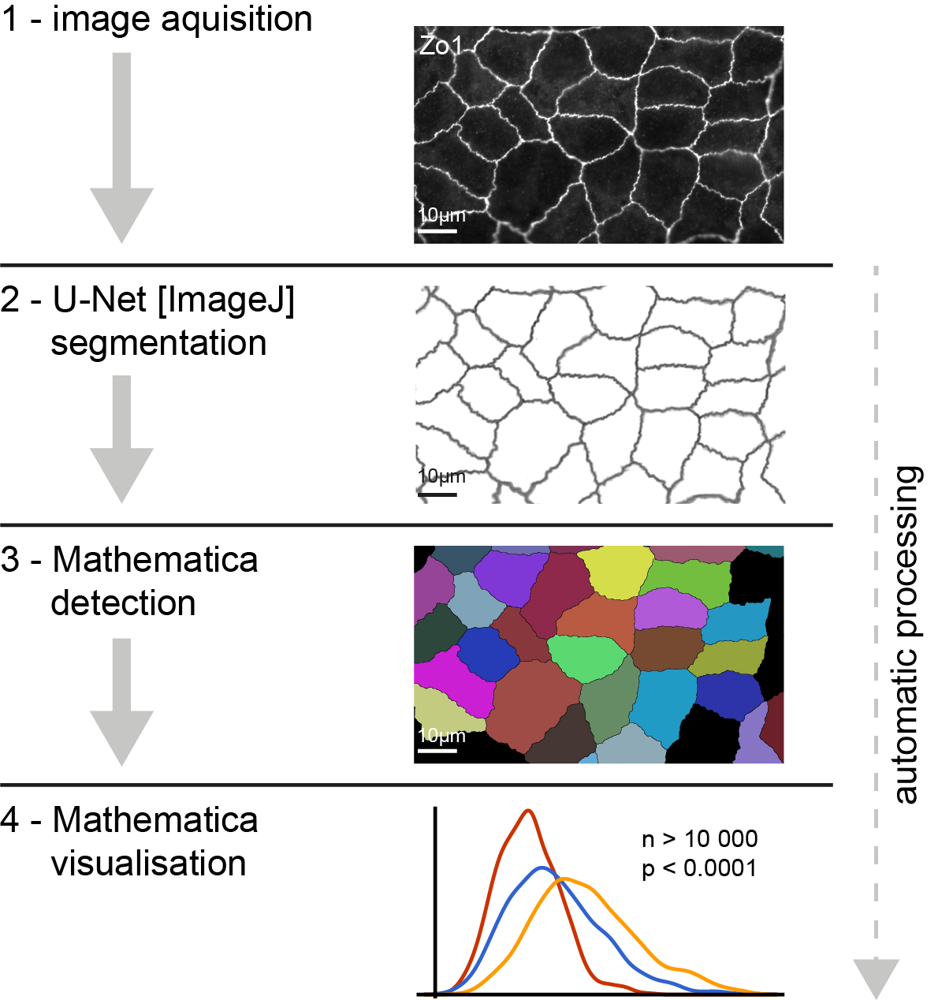
<figcaption>Processing steps of the whole workflow</figcaption>
</figure>

# 2. Preparation

All necessary files, portable software and documentation can be found on
github: https://github.com/JahnJ/U-Net-based-image-quantification-of-epithelial-cell-shapes/tree/main

They should be copied to the storage of each local machine to avoid
problems. Please read the whole documentation carefully.

# 3. Image acquisition and preprocessing

This chapter covers all relevant information for image capturing with
immunofluorescence microscopes and the necessary file naming and folder
structure for the automatic image pipeline.

## Capturing process

For the published work the images were captured with a Carl Zeiss Axio
Observer Z.1 microscope. To avoid problems with later processing steps
preferably use similar settings:

- objective: Objektiv i Plan-Apochromat 63x/1.4 Oil DIC M27

- optovar: 1x Tubelens

- exposure time: manually set and consistent for each dataset

- file format: Carl Zeiss Image (\*.czi)

This will result in following image dimensions:

- image size (pixel): 1388 x 1040

- image size (scaled): 142.10µm x 106,48µm

- scaling: 0.1024µm/pixel

Preparations with multiple staining’s and different wavelengths can be
captured in one step and saved to one file; the wavelength channels can
later be separated from each other. If necessary, different focus plains
can be captured and saved to individual files. For file naming please
see chapter 3.

Based on the preparation condition the image quality may vary and affect
the processing. Especially some of the ZO-1 antibodies produce weak
stainings and image capturing can be quite a challenge. The best
possible preparations and image sections should be saved. However,
cherry picking should be avoided. The strength of the automatic image
processing lies in the large number of images and big datasets. The user
introduced bias should be as low as possible. Also, the focus point
should be exact on the relevant structures. Out of focus image parts
might be ignored in the automatic processing or lead to incorrect
results.

If you use other microscope vendors the file format may change. Larger
adaptions to the ImageJ script and the U-Net processing may be
necessary.

### Special Case: stitched images

Stitched images can be captured. They consist of multiple contiguous
image tiles. This increases the amount of data in a single image and
reduces the selection bias. The number of image tiles can usually be
selected in the microscope software and is automatically captured.
Stitched images in 3x3 configuration appeared to show the best results
regarding capture time, processing speed and information gain. Other
configurations up 10x10 are possible without difficulty.

The remaining microscope configurations, as described above, can stay
the same. The image size varies depending on the number of tiles. The
scaling 0.102µm/pixel should stay the same or will otherwise be rescaled
be the U-Net.

## File naming and folder structure

Most of the scripts and software expect an exact folder name and will
interrupt, if something variate. Therefore, it is extremely important to
use a consistent naming scheme. The following rules should be convenient
to organize the files and are essential for the whole processing.

### Folder names and structure

This is an example how the folder-tree should look like:

<figure id="fig:foldertree">
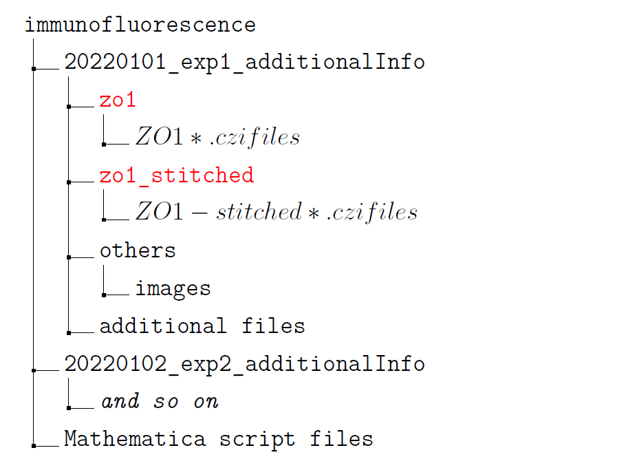
<figcaption>Example folder structure</figcaption>
</figure>

All Folders marked in red need to have the exact name, otherwise the
scripts won´t work. Other folders can be individually changed by the
user. Long folder names can be a problem one some operating system and
should be avoided!

For each experiment, dataset or staining an own folder can be created.
These folders can begin with the date in the style YYYYMMDD for easy
identification and sorting. Additional information can be added to this
folder name. For stitched images the suffix ’\_stitched’ needs to be
added to the folder name (e.g. dapi_stitched). The file names can be
individually chosen.

Additional files (for example: text- or excel-files) can be stored in
the folders. They are ignored during processing.

# 4. U-Net segmentation

This chapter lists all steps necessary to use the U-Net segmentation via
ImageJ. To avoid the multiple pitfalls that might interrupt the
processing the following chapter should be studied very carefully.

## Initial Preparation

The technical implementation of the U-Net deep learning requires two
components: A Server running the necessary deep learning framework and
performing the segmentation step of the images. Furthermore, another
computer running ImageJ as a client software to communicate with the
server and sending the image files. ImageJ can be run on nearly any
computer.

## U-Net Server

The details on setting up the U-Net server are slightly complicated and
will not be discussed at this point. Please have a look at [2] and [3].

## ImageJ/Fiji

ImageJ is a widely used software for medical and scientific image
editing and analysis. Fiji is an adapted version of ImageJ with an
extended set of plugins. For the U-Net client implementation Fiji with
the U-Net plugin is used in the following version, updated versions of
ImageJ should in theory work without problems.

- Fiji ImageJ 1.53b + Java 1.8.0_212

- U-Net Plugin v20190926220201

- HDF5_Vibez Plugin v20150214134118

## First use on new Client machine

On every new client computer/user account a few basic settings need to
be configured when using ImageJ for the first time.

### Delete ImageJ configuration

To avoid problems with older ImageJ versions and settings the
configuration file should be deleted.

1.  On windows machines move to following folder:
    C:/Users/Username/.imagej/

2.  Delete the ’IJ_Prefs.txt’ file

### Bio-Formats configuration

The Bio-Formats plugin handles the loading and pre-processing of
microscope image files. For the Zeiss ’czi-files’ a few specific
adjustments need to be made for automatic processing.

1.  Open ImageJ

2.  Click on ’File’ ’Open’ and open a random czi-file. This should open
    the import options dialogue window

3.  Select the options as shown in the figure
    <a href="#fig:bioformats-1" data-reference-type="ref"
    data-reference="fig:bioformats-1">below</a>. Especially ’Split
    channels’ is important

4.  Click ok and close the opened image

5.  Click on ’Plugins’ ’Bio-Formats’ ’Bio-Formats Plugins Configuration’

6.  Click on the ’Formats’ tab and select ’Zeiss CZI’ in the list

7.  Check all boxes as shown in the figure
    <a href="#fig:bioformats-2" data-reference-type="ref"
    data-reference="fig:bioformats-2">below</a>. This will hide the import
    options dialogue window when opening a file

<figure id="fig:bioformats-1">

<figcaption>Bio-Formats import options</figcaption>
</figure>

<figure id="fig:bioformats-2">
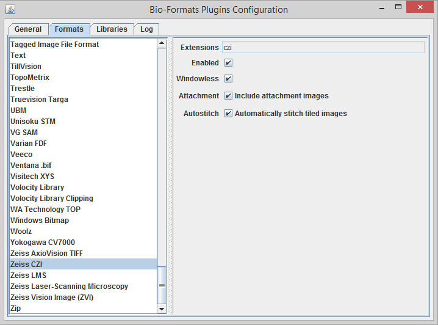
<figcaption>Bio-Formats Plugins configuration</figcaption>
</figure>

### U-Net plugins settings

The U-Net plugin handles the connection to the remote U-Net server and
the transfer of the image files opened for segmentation. Before using
the script for automatic processing, the plugin needs to be run by hand
for one time to write relevant options in the configuration file. These
steps can also be used if you want to segment a single image e.g. for
fast analysis or to monitor the quality of the trained model.

1.  Open ImageJ

2.  Click on ’File’ ’Open’ and open a random czi-file.

3.  Click on ’Plugins’ ’U-Net’ ’Segment Current Image (Hyperstack)’

4.  Enter the fields as shown in figure
    <a href="#fig:unet-plugin" data-reference-type="ref"
    data-reference="fig:unet-plugin">below</a>. The model-file (filename
    ends with \*.modeldef.h5) and RSA-keyfile should be stored on your
    local machine. The file path can be selected with the folder button.

5.  Click and wait until segmentation is finished (will open a new
    windows with the segmented image)

6.  When executing the plugin for the first time a few dialogs need to
    be accepted by clicking on ’yes’. These dialogs are shown in the figure
    <a href="#fig:ssh-messages" data-reference-type="ref"
    data-reference="fig:ssh-messages">below</a>.

7.  Close all images

<figure id="fig:unet-plugin">
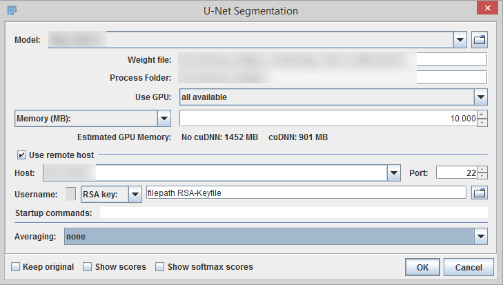
<figcaption>U-Net segmentation plugin with filled in
settings</figcaption>
</figure>

<figure id="fig:ssh-messages">
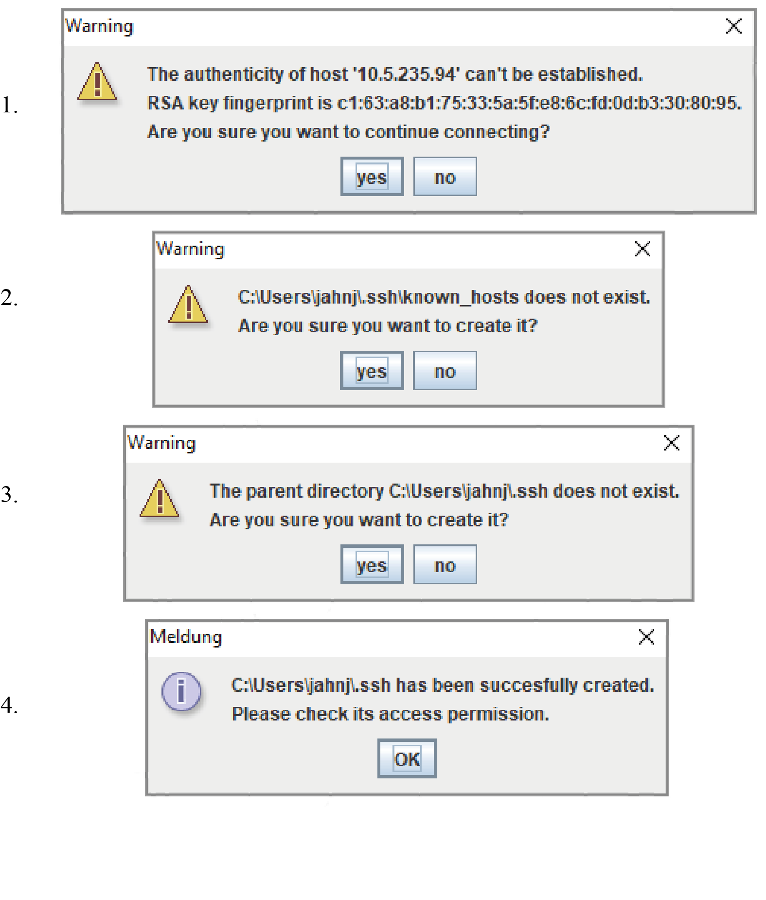
<figcaption>Dialogs to confirm when starting the U-Net segmentation for
the first time</figcaption>
</figure>

### Adapt Script to new machine

The provided script for ImageJ combines all functions from image
loading, U-Net segmentation and file saving. It is the essential part in
the automated workflow. It contains a few basic options, such as file
paths, that need to be manually set for each machine.

1.  Open ImageJ

2.  Click on ’File’ ’Open’ and open the provided file
    ’U-Net-Processing-Library_v2.ijm’ (or newer version number).
    Alternatively, you can drag and drop the file into ImageJ

3.  This opens a new window showing the source code of the script (see
    figure with the <a href="#fig:image-script" data-reference-type="ref"
    data-reference="fig:image-script">code</a>)

4.  Change the server settings and adapt the file paths of the RSA- and
    model-files to the paths of your local machine (line 19-30, see figure with the
    <a href="#fig:image-script" data-reference-type="ref"
    data-reference="fig:image-script">code</a> - line number might change
    in newer versions of the script)

5.  The processing step size (line 37-38) can be reduced when the
    computer has a small amount of memory

6.  Click on ’File’ ’Save as…’ and save the changed file to your machine

<figure id="fig:image-script">
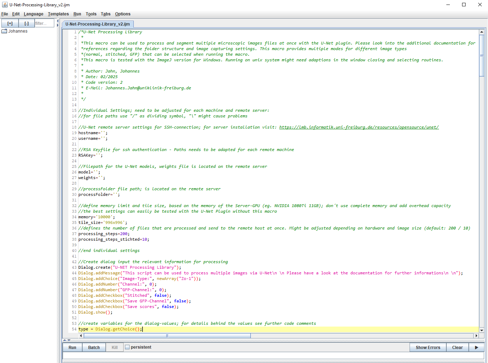
<figcaption>U-Net processing script opened in ImageJ showing parts of
the source code</figcaption>
</figure>

## Automatic image segmentation via U-Net

To minimize the necessary user interaction and to provide an easy
application a script for ImageJ was developed. As described above it
combines and automates all essential steps in the U-Net segmentation
workflow. The execution of the script is fairly easy and only needs a
few input settings by the user.

### Start the script

Now the actual U-Net processing can start. After setting up the
parameters the script will process the input folder with all subfolders
completely automatic. Depending on image size, number of files and
network speed this might take a while (usually 15min for 200 single
images, stitched images take longer). When finished a dialog box is
displayed.

1.  Open ImageJ

2.  Click on ’File’ ’Open’ and open the provided file
    ’U-Net-Processing-Library_v2.ijm’. Alternatively, you can drag and
    drop the file into ImageJ

3.  This opens a new window showing the source code of the script. Click on ’Run’ in the
    bottom left part of the window

4.  Select the settings you want to use to process the folder and press
    ’OK’. (Description of the
    settings is written in section
    <a href="#ssec:script-settings" data-reference-type="ref"
    data-reference="ssec:script-settings">below</a>)

5.  Select the folder you want to process in the opened dialogue window
    (Please refer to the folder guidelines chapter 3.

6.  The next dialog window reports the number of files found in the
    selected folder. Press on ’OK’ to start the processing.

7.  Wait till the whole process is finished and it will show the final
    dialog box. You can see the current processing steps in the bottom
    part of the ImageJ main window. Depending on the server-connection
    and the amount of images it may take a while

<figure id="fig:script-filenumber">
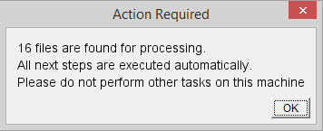
<figcaption>Dialog window showing the number of detected files before
starting the U-Net processing</figcaption>
</figure>

### Script settings

The script can handle various settings for different experiments and
image formats. At the beginning of the script-run a dialog window let
the user select the desired settings for the specific dataset. Below the details
for each selectable option are shown:

- Image-Type: The dropdown list lets the user select the antibody
  staining for the images. For multiple fluorescence channels in one
  image the script needs to be run multiple times.

- Channel: For images with multiple fluorescence channels the number of
  the channel matching the selected antibody staining/image type is
  specified. The channel numbering starts with the ’0’. For example:
  image file with two channels: DAPI: channel 0; ZO-1: channel 1

- GFP-Channel: For images with GFP fluorescence the number of the
  GFP-channel is specified. It only needs to be inputted if the ’Save
  GFP-Channel’-option below is checked.

- Stitched: If checked the script will search for stitched images and
  apply necessary preprocessing options.

- Save GFP-Channel: If checked the script will process the specified
  GPF-channel and save the channel in a separate file. For some
  experiments this can be used to get additional information about
  different genotypes in one image.

- Save scores: If checked the script saves the score image generated by
  the U-Net plugin. It can be used to validate the segmentation output.
  For usual analysis this option is not needed.

<figure id="fig:script-settings-window">
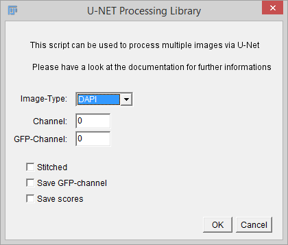
<figcaption>Script dialog window to select the settings for automatic
processing</figcaption>
</figure>

### Processing folders and validation overlays

Inside each image folder the script will create a set of subfolders to
store the processed data. These will also be used for further processing
steps in Mathematica. The filename of the newly created files mostly
consists of the original image-filename with an added suffix. Hence, the
original filename should be carefully composed. Following files are
stored inside the created folders:

- gfp: this folder stores the processed GFP image.

- processing: Used by Mathematica (see chapter 5 and 6) to save the processed
  image

- processing_overlay: Used by Mathematica to save additional images for
  validation purposes

- processing_xlsx: Used by Mathematica to save the computed values in an
  excel file (\*.xlsx)

- segmented_overlay: Stores an overlay image, that can be used validate
  the U-Net output. It overlays the original image (s/w) with the U-Net
  segmentation (green). Example shown in figure
  <a href="#fig:unet-output" data-reference-type="ref"
  data-reference="fig:unet-output">below</a>

- zo1_seg: This folder contains the segmentation images generated by the
  U-Net. These are 16-bit tiff-files. Hence, most image viewers
  (Windows/Photoshop) have problems viewing these files. ImageJ can open
  these images without trouble. Example shown in figure
  <a href="#fig:unet-output" data-reference-type="ref"
  data-reference="fig:unet-output">below</a>

- zo1_seg_score: This folder stores the additional image file, that
  shows the segmentation scores. Please use ImageJ to open these files.
  Example shown in figure
  <a href="#fig:unet-output" data-reference-type="ref"
  data-reference="fig:unet-output">below</a>

<figure id="fig:unet-output">
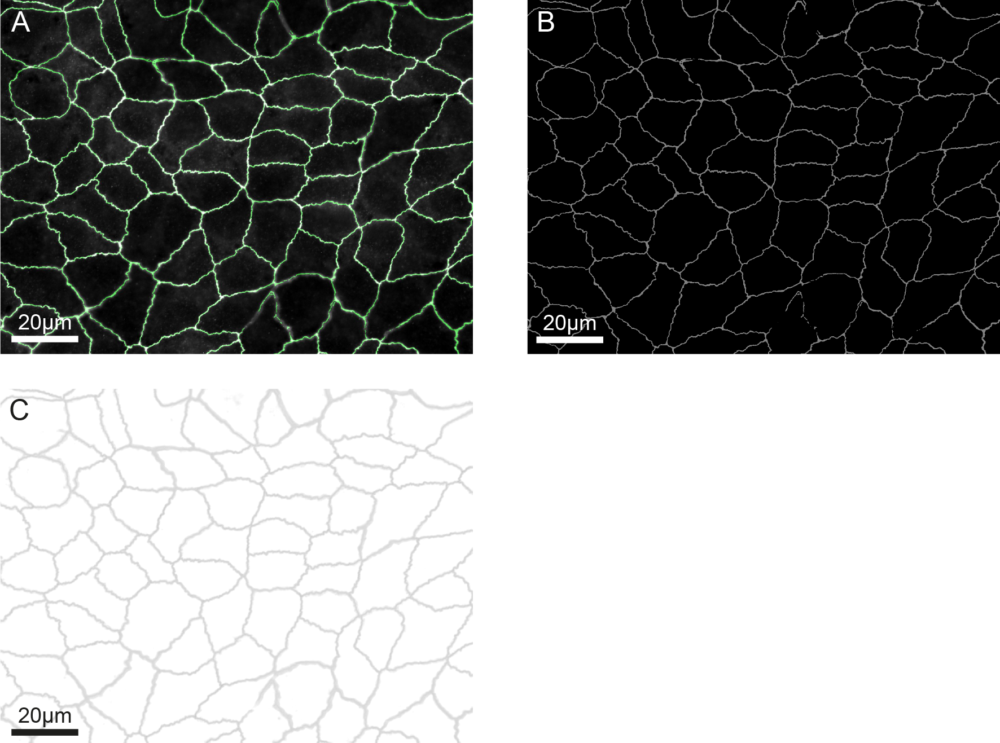
<figcaption>A: validation overlay showing the raw image and the U-Net
segmentation in green; B: U-Net segmentation, in this case showing the
detected cell borders; C: This image shows the scores computed by the
U-Net network - based on these values the segmentation is
generated.</figcaption>
</figure>

## Common Errors

Unfortunately, the whole process is not completely error-free. Most
problems occur with the server connection to the U-Net server or missing
files. The most common errors and their solution are described below.
For other errors restarting ImageJ or the operation system might help.
Otherwise, a fresh installation following all steps of this
documentation can help.

##### Error Message ImageJ:

In rar cases opening ImageJ or the U-Net processing script might cause
an error. This is shown in an additional console window. Restarting ImageJ and/or
the operating system should fix this problem.

<figure id="fig:imagej-error-1">

<figcaption>ImageJ error message</figcaption>
</figure>

##### No files are found or the number doesn’t match the input:

The script will display an error message if no files for processing are
found. In this case check if the right input folder was selected, if the
subfolders match the required name scheme (see chapter 3) and if all microscopic
image files are correctly placed. Rerun the script after resolving these
problems. If the number of files doesn’t match the expected quantity,
likely a typo or other problems with the folder name might cause image
files not to be found.

<figure id="fig:imagej-error-2">
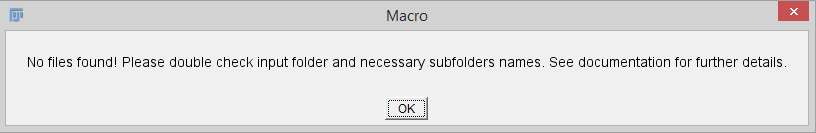
<figcaption>Error message when no files are found</figcaption>
</figure>

##### SSH connection error:

If the U-Net server cannot be reached an error is displayed. After this initial
message multiple error messages are displayed which can be ignored. To
fix this error double check the network settings. Sometimes ImageJ needs
to be restarted, after setting the connection.

<figure id="fig:imagej-error-3">
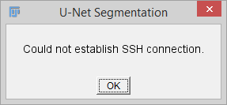
<figcaption>Error message when the U-Net server can not be
reached</figcaption>
</figure>

##### Modell/RSA Key not found:

The script will display an error message, if essential files for the
processing are not found. The file paths need to be
checked and corrected.

<figure id="fig:imagej-error-4">
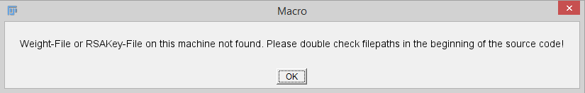
<figcaption>Error message when crucial files are not found</figcaption>
</figure>

##### Weight file upload dialog:

This window is shown if the weight file (part of the U-Net model) is not
found on the server. Click on ’Abbrechen’ or
’cancel’ and check the file paths.

<figure id="fig:imagej-error-7">
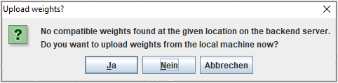
<figcaption>Upload dialog when essential parts of the U-Net model are
not found on the server or the given file path is wrong</figcaption>
</figure>

##### Other errors:

Other errors can occur when the depending files on the U-Net server are
moved or changed. Make sure the file paths
stated in the script are correct and contact the U-Net server
administrator for persisting errors . Another rare error is displayed
when any step in the script might cause problems. In this case restart
ImageJ and rerun the script. Check your input files and microscope
settings.

<figure id="fig:imagej-error-5">

<figcaption>U-Net error message</figcaption>
</figure>

<figure id="fig:imagej-error-6">
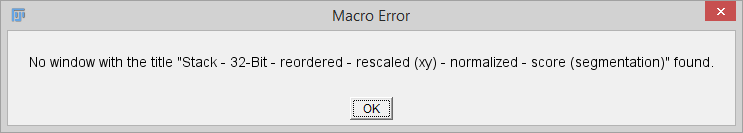
<figcaption>Script error showing difficulties in automatic
processing</figcaption>
</figure>

# 5. Mathematica Scripts Part 1 - Detection

This chapter covers the second step in the automatic processing pipeline
which applies the modeling functions and algorithms at the previously
segmented images.

## Initial Preparation

After finishing the U-Net processing in ImageJ, later steps are executed
in Mathematica. Mathematica is a software package developed by Wolfram
Research and provides a programming language with lots of advanced image
processing and visualization methods. An activated Mathematica
installation on the local machine is needed to run the analysis. All
scripts containing the processing functions were developed and
extensively tested on Mathematica 12. Newer versions should also work.
For details on purchasing and installing Mathematica please have a look
at the website https://www.wolfram.com/mathematica/.

## The scripts

Source code in Mathematica is organized in so called ’Notebooks’. An own
script/notebook was developed, which contains all the functions and
methods to process the images. You don’t need to know the technical
details and using the scripts/notebooks is done in a few easy steps
described below. For technical insights
please have a look at the whole commented source code listed under
’Initialising’ in the notebook itself.

Following core features are implemented in the scripts: Detect the cells
based on the tight junction segmentation. Apply a smooth model and
calculate the model parameter R-index showing differences in tight
junction structure (riffle vs. smooth). For special experiments the
cells can be fragmented into multiple cell border segments and the
orientation of these segments based on the neighbor cell genotype is
calculated.\
The name ’Detection’ is referring to the first step in Mathematica,
which applies the developed modeling and analyzing algorithms to the
segmented images generated by the U-Net.

Every notebook is structured in a similar way. When opening the file it
shows the different parts in a plain overview (see figure
<a href="#fig:mathematica-script-screen" data-reference-type="ref"
data-reference="fig:mathematica-script-screen">below</a>). The header
shows the name of the script and basic information like date of last
changes. The ’Change log’ and ’Initializing’ part should be collapsed.
When opening it with the arrow symbol it shows details about the latest
applied changed or the whole annotated source code with all necessary
functions. The ’Run’ part contains the relevant variables, that are
definable by the user itself, and the functions to run the script
divided in one or multiple code blocks.

<figure id="fig:mathematica-script-screen">

<figcaption>Screen when opening a Mathematica notebook, in this case for
the ZO-1 detection script. The brackets on the right side show the
separation of the code blocks.</figcaption>
</figure>

## Placing the scripts

Each script will look for the specific file and folder structure. After finishing the
U-Net processing the Mathematica script needs to be placed in the parent
folder, as shown in the folder tree at chapter 3. No files or folders need
to be changed between between these processing steps. The script will
automatically find the right folders containing the segmented images.
Multiple subfolders (e.g. for different experiment dates) are
automatically detected and processed in one run of the script. Placing
the script file at another folder might lead to wrong results picking
not all or too many files. Please be sure that only the files/folders
you want to process are in the subfolders at the script location.

## Run the scripts

After all preparations the scripts can be run. Depending on image size,
number of files and the scripts settings it might take some time and can
run hours until finished. A progress bar gives a visual output about the
current status. Each code block needs to be run separately. The single
code blocks a separated by brackets shown on the right side of the
notebook.

1.  Open the script placed in the parent folder.

2.  Scroll down to the ’Run’ section.

3.  Right click on the first code block (preferably directly on the text
    to select the correct block) and click onto ’Evaluate Cell’ in the
    dropdown menu. The first block will close all existing computation
    kernels which will help avoid side effects with previously run
    scripts.

4.  When asking ’Do you want to automatically evaluate all the
    initialization cells in the notebook’ click on ’Yes’.

5.  Wait until execution is finished – the code block brackets on the
    right side stays bold during the execution.

6.  Adapt the settings in the second block if required.

7.  Evaluate the second block as described in Step 3 and 5.

8.  Evaluate the third block as described in Step 3 and 5. This should
    display a text with the number of files found for processing.
    Recheck file structure if numbers don’t match the expectations.

9.  Evaluate the fourth block as described in Step 3 and 5. This block
    starts the actual image processing and may take some time until
    finished.

10. Close the script when all code blocks ran successfully. The script
    file doesn’t need to be saved.

## Script settings

The second code block in the ’Run’-section (’Define settings’) of each
script lets the user define parameters of the processing. Most of the
time the default settings are suitable and don’t need to be changed. The
following table shows the different variables with a short explanation.

| parameter name | default setting | explanation |
|:---|:---|:---|
| parameter name | default setting | explanation |
|  |  |  |
| segFolderZo1 | ’\\zo1_seg \\’ | See explanation above: ’segFolderDapi’. |
| gfp | False | This setting will enable an additional analysis mode. It can only be used if for each image the GFP-immunofluorescence channel is also acquired and saved in an additional file (can be done with the ImageJ script). This can divide the cell population into different groups (e.g. wild type and knock-out). To enable set the parameter to True’. |
| gfpFolder | ’\\gfp \\’ | Defines the folder that stores the additional GFP-images. Will only be used if GFP-processing is requested (see above). The folder is usually created by the ImageJ-script and the default setting doesn’t need to be changed. |
| singleBranch | False | This setting will enable an additional analysis mode that divides each detected cell object into subsegments of the cell wall. Measurements are acquired for each subsegment and not the whole cell. In most cases this step is combined with the GFP-analysis and specific cell segments (e.g. between wild type and knock-out cells) can be examined. To enable set the parameter to ’True’. |
| formAnalysis | False | The form analysis function will create a matrix file overlaying all detected cells. This can be used for advanced evaluation of morphogenesis. In most cases this setting is experimental and can be excluded, otherwise the setting can be changed to ’True’. |
| pixelSize | 0.1024 | See explanation above: ’pixelSize’ |

## Interpret output

The detection scripts create multiple files containing the measurements,
images showing the modelling effects and images that can be used to
validate the output or the processing in general. The following
subsection lists all created export files with a short description. The
star ’\*’ in the filename is a place holder for the original file name
of each immunofluorescence image file.

### ZO-1

All files created with the ZO-1-Detection script:

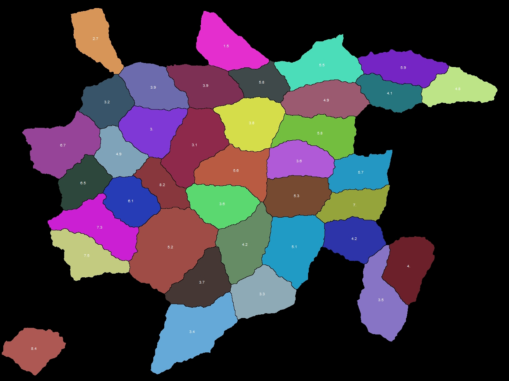
<figcaption>zo1/processing/*_original.jpg: The detected, coloured cells are shown with the calculated R-Index displayed in the middle of each cell.</figcaption>
</figure>

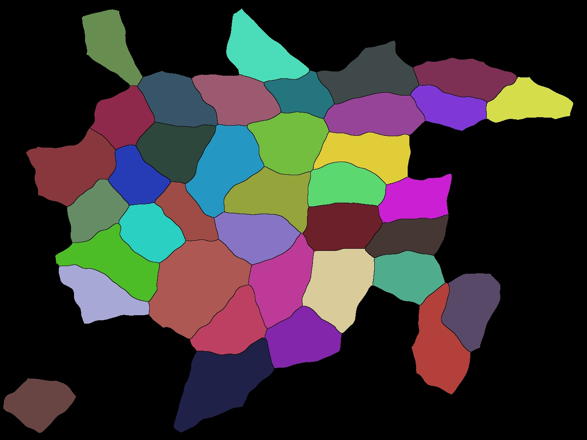
<figcaption>zo1/processing/*_round.jpg: These images show the cell objects after applying the smooth model.</figcaption>
</figure>

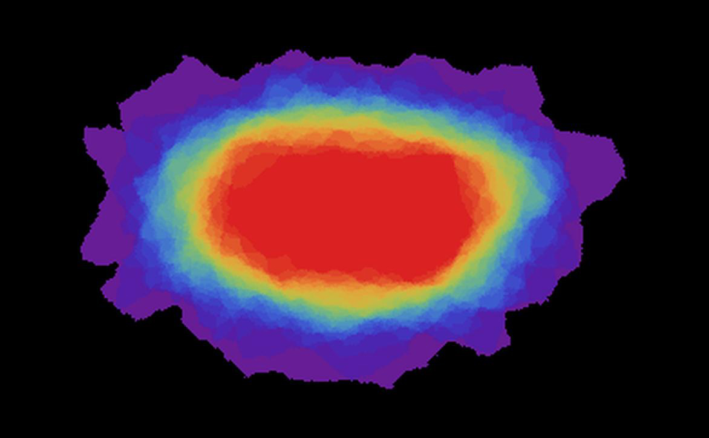
<figcaption>zo1/processing/*_form_analysis _fullcell.jpg.jpg: This file is only created if the form analysis function is used. It will overlay all detected cell objects with their centre points and create a head map showing overlapping parts (violet: only a few cells overlap at this pixel, red: most cells overlap at this pixel) It´s a simple way to visualise differences in morphogenesis.</figcaption>
</figure>

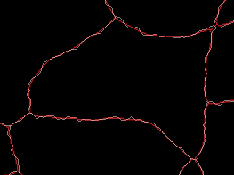
<figcaption>zo1/processing/*_overlay_riffle _round.jpg: This is a validation image, that overlays the U-Net output with the smoothed cell borders that are created in the modelling process. It can be used to check to quality of the modelling.</figcaption>
</figure>

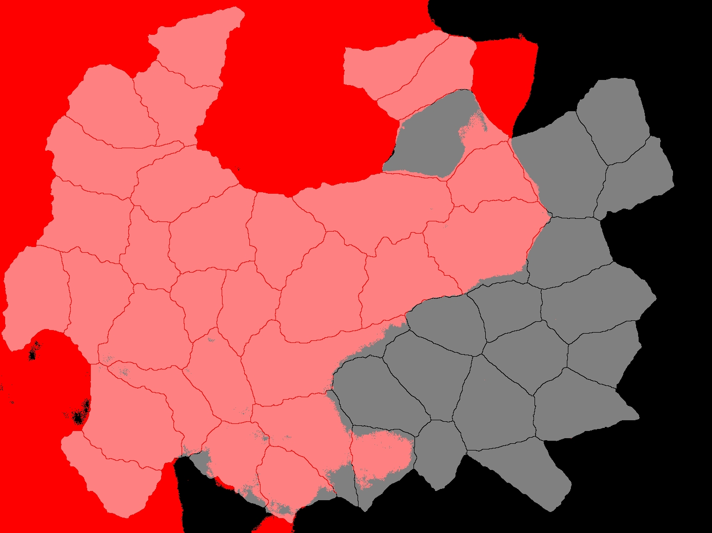
<figcaption>zo1/processing/*_gfp_overlay.jpg: This file is only created if the GFP-processing is requested. This image overlays the GFP-signal (in red) with the detected cells. GFP labelled cells and irregularities in the GFP-signal can be easily spotted.</figcaption>
</figure>

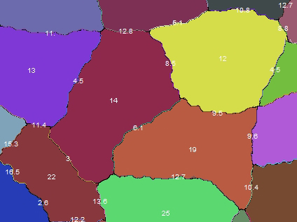
<figcaption>zo1/processing/*_single _branch.jpg: Only created when the single branch analysis is used. This image shows the detected cells and displays the R-Index for each segment of the cell border. Can be used to evaluate the modelling of the branch analysis. When using additional GFP-information (as shown in the ’gfp_overlay’-file) the differences of the subgroups can be seen.</figcaption>
</figure>

#### Excel output file

##### zo1/processing_xlsx/\*\_zo1.xlsx:

This is the essential file containing all measurements. It’s the basis
for later visualisation and data processing. See figure
<a href="#fig:zo1-excel-1" data-reference-type="ref"
data-reference="fig:zo1-excel-1">below</a> for an example of the file
structure. Row 3 shows the mean values of all single cell objects (that
are listed in the second part of the file) and therefore provide key
values for the whole image. Following parameter are acquired and shown
in the columns (less important parameters are greyed out):

<figure id="fig:zo1-excel-1">
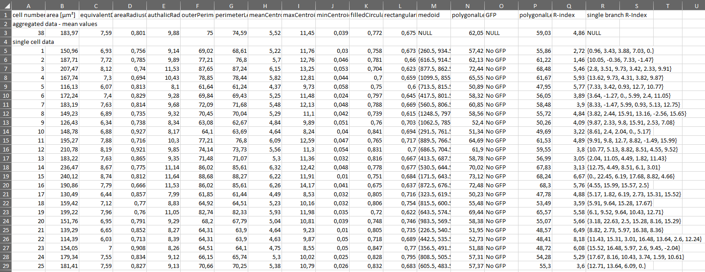
<figcaption>Example structure of the excel file containing all ZO-1
related measurements</figcaption>
</figure>

| parameter | unit | description |
|:---|:---|:---|
| cell number | \- | Individual number of each cell |
| area | µm² | approximate area, where each pixel area is weighted by its neighborhood configuration |
| equivalentDiskRadius | µm | radius of a disk that has the same area |
| areaRadiusCoverage | \- | fraction of pixels within the equivalent disk radius |
| authalicRadius | µm | radius of a circle with the same polygonal perimeter length |
| outerPerimeterCount | µm | number of elements adjacent to the component |
| perimeterLength | µm | total length of outer pixel sides |
| meanCentroidDistance | µm | mean distance of all elements from the centroid |
| maxCentroidDistance | µm | maximum distance of all elements from the centroid |
| minCentroidDistance | µm | minimum distance of all elements from the centroid |
| filledCircularity | \- | circularity after filling holes. This parameter can be used as a marker for cell morphogenesis. Round cell objects have a circularity close to ’1’, whereas irregular shaped cells have smaller values. |
| rectangularity | \- | fraction of pixels within the minimal bounding box |
| medoid | {pixel-position, pixel-position} | coordinate of the closest element to the centroid |
| polygonalLength | µm | total length of the polygon formed by the centers of the perimeter elements. Most accurate parameter for the cell circumference and one of the key parameters for the R-Index model. |
| GFP | True/False | Shows the GFP-status of the cells, if an additional GFP-file is available and the processing option is used. Otherwise, the table shows ’no GFP data’. |
| polygonalLength smooth | µm | Polygonal length for the round cell objects (see above at polygonalLength) |
| R-Index | \- | The key modelling parameter showing the differences in cell border homogeneity and riffle strength. |
| single branch R-Index | \- | List of R-Indices for each subsegment of the cell border if the single branch processing is used. Otherwise, this field is left empty. |

#### Excel output file branches

##### zo1/processing_xlsx/\*\_branches.xlsx:

This excel file is only created if the single branch processing is used.
Like the ’\*\_zo1.xlsx’-file it shows all measurements and is used in
later steps. It is based on a similar file structure with row 3 showing
the mean values of the whole image. For each single segment the
measurements are listed in the second part of the file. See figure
<a href="#fig:zo1-excel-2" data-reference-type="ref"
data-reference="fig:zo1-excel-2">below</a> for an example of the file
appearance. Following parameters are listed (less important parameters
are greyed out):

<figure id="fig:zo1-excel-2">
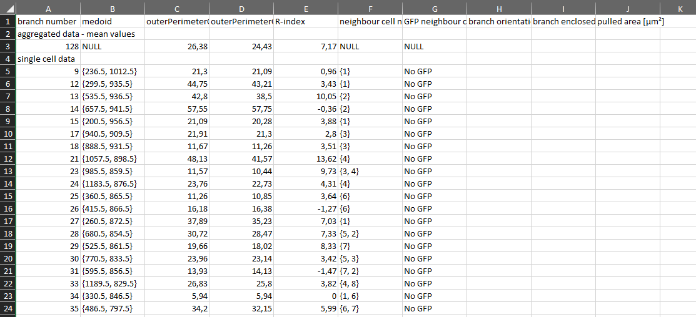
<figcaption>Example structure of the excel file containing all
measurements from the single branch analysis</figcaption>
</figure>

<table>
<thead>
<tr>
<th style="text-align: left;">parameter</th>
<th style="text-align: left;">unit</th>
<th style="text-align: left;">description</th>
</tr>
</thead>
<tbody>
<tr>
<td style="text-align: left;">branch number</td>
<td style="text-align: left;">-</td>
<td style="text-align: left;">Individual number of each cell border
segment.</td>
</tr>
<tr>
<td style="text-align: left;">medoid</td>
<td style="text-align: left;">{pixel-position, pixel-position}</td>
<td style="text-align: left;">coordinate of the closest element to the
centroid</td>
</tr>
<tr>
<td style="text-align: left;">outerPerimeterCount</td>
<td style="text-align: left;">µm</td>
<td style="text-align: left;">number of elements adjacent to the
component. For
the single branch analysis the outerPerimeterCount showed better results
when computing the R-Index.</td>
</tr>
<tr>
<td style="text-align: left;">outerPerimeterCount-smooth</td>
<td style="text-align: left;">µm</td>
<td style="text-align: left;">Same as above for the smoothed
segment.</td>
</tr>
<tr>
<td style="text-align: left;">R-Index</td>
<td style="text-align: left;">-</td>
<td style="text-align: left;">Modelling parameter showing the
differences in segment riffle.</td>
</tr>
<tr>
<td style="text-align: left;">neighbor cell number</td>
<td style="text-align: left;">{#} or {#,#}</td>
<td style="text-align: left;">Shows the number of the neighbour cells.
When one of the neighbour cells couldn’t be detected only one number is
saved.</td>
</tr>
<tr>
<td style="text-align: left;">GFP neighbor cell</td>
<td style="text-align: left;">{Bool} or {Bool,Bool}</td>
<td style="text-align: left;">Returns the GFP-status of the neighbor
cells, if an additional GFP-file is available and the processing option
is selected. Otherwise, the table shows ’no GFP data’.</td>
</tr>
<tr>
<td style="text-align: left;">branch orientation</td>
<td style="text-align: left;">text</td>
<td style="text-align: left;">
This parameter is only available when
GFP-modelling is used. It uses the medoid of the segment to determine if
the segment is predominantly pulled to one of the neighbor cells:

<ul>
<li>
non GFP cell pulls
</li>
<li>
GFP cell pulls.
</li>
<li>
non distinguishable: Difference too small to make
prediction.
</li>
<li>
Null: only one neighbour cell detected or both with the same
GFP-labelling (same genotype).
</li>
</ul></td>
</tr>
<tr>
<td style="text-align: left;">branch enclosed area</td>
<td style="text-align: left;">µm²</td>
<td style="text-align: left;">This parameter is only available when
GFP-modelling is used. Both ends of the segment are connected and the
enclosed area is computed. Only computed when two neighbor cells of
different types are present.</td>
</tr>
<tr>
<td style="text-align: left;">pulled area</td>
<td style="text-align: left;">µm²</td>
<td style="text-align: left;">Based on the enclosed area (see one above)
the overlapped area with the GFP-cell and non-GFP-cell is calculated.
The difference between this two values is the pulled area. When positive
the GFP-cells pulls the segment with the stated area. When negative the
non-GFP cell pulls the segment.</td>
</tr>
</tbody>
</table>

##### zo1/processing_xlsx/\*\_raw-matrix_fullcell.mat:

This file is only created if the form analysis function is used. It
contains the shape data of each cell object. Might be helpful for
advanced morphogenesis studies, currently the file is not commonly used.

##### zo1/processing_xlsx/\*\_zo1.txt:

If no cell objects are detected in the image (e.g. unsharp microscope
image with inadequate U-Net segmentation) a text-file is created instead
of the xlsx-files containing the measurements. This way the faulty files
can easily be spotted.

## Common Errors

Unfortunately, the execution of the Mathematica scripts is not
completely error-free. Compared to the second step in ImageJ errors are
significantly rarer. Errors are shown as red text below the error
inducing cell block. In most cases it helps
to completely close and restart Mathematica and the script. Get the
default version of the script to avoid unknowingly changes in the source
code. Check the folder structure and if the script has detected as much
image files as expected (number is displayed when executing the third
code block in the script). Sometimes only one image file might be faulty
and generate the error message with all other images being processed
without problems.

<figure id="fig:mathematica-error">
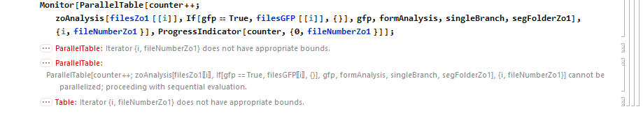
<figcaption>Mathematica script errors lead to a red error messages below
the code block.</figcaption>
</figure>

# 6. Mathematica Script Part 2 -Visualization

This chapter covers the last step in the automatic processing pipeline
which reworks the gathered data and creates basic visualizations.

## Initial Preparation

After successfully running the detection script as described chapter 5, the second step in
Mathematica can be executed. The ’Visualisation’-step offers two
essential features. It combines the previously generated data to create
simple graphs and statistical reports to easily see differences between
genotypes or subgroups in the datasets. Additionally, the combined data
is saved in an accessible way to use it in further statistical software.
The script is build very similar compared to the detection script.

## Data preparation

Before the scripts can be used the result excel files created with the
’Detection’-script need to be resorted into a new folder structure. The
previously used structure, that is automatically created by the ImageJ
script, is an easy way to store the image files in a logical order and
divided by different experiments. To compare various genotypes the
’Visualisation’-script needs to know which files belong together. The
disadvantage: This step needs to be done by hand as it could not be that
easily automated as the other steps. The advantage. The user can define
exactly what files or genotypes should be compared, which files should
be excluded or which different experiments should be mixed. When
comparing too many genotypes it can cause trouble with the visualization
in the autogenerated graphs. Usually 3-4 genotypes per comparison work
without a problem. Multiple comparison folders can created by once, the
scripts will automatically process them one by one. The new required
folder structure for the visualization step is built as follows:

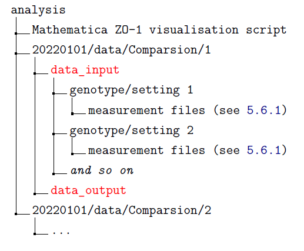
<figcaption>Example folder structure</figcaption>
</figure>

All Folders marked in red need to have the exact name, otherwise the
scripts won’t work. Other folders can be individually changed by the
user, but the folder structure inside the data_input folders needs to
stay the same. The ’genotype/setting’ name will be used in the graphs to
label the data. One exception are the GFP ZO-1 files. These don´t need
to be separated by genotype an should be sorted in one folder:

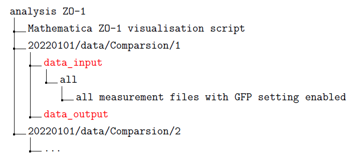
<figcaption>Example folder structure for GFP analysus</figcaption>
</figure>

### Different settings

Depending on the settings used in the Mathematica detection script,
different result files are created. The possible combinations and the
right files for the visualization step are listed in the following part.

##### ZO-1 without single branch or GFP functionality:

Sort the ’\*\_zo1.xlsx’ files from the ’zo1/ processing_xlsx/’-folder in
the different genotype folders.

##### ZO-1 with single branch analysis:

Sort the ’\*\_branches.xlsx’ files from the
’zo1/processing_xlsx/-folder’ in the different genotype folders.

##### ZO-1 with GFP analysis:

In this case the files don’t need the separation into different
genotypes since the GPF information will provide this categorization
(GFP positive cells = genotype 1, GFP negative cells = genotype 2). Sort
the ’\*\_zo1.xlsx’ files from the ’zo1/processing_xlsx/’-folder in one
folder inside the ’data_input’-folder e.g. named ’all’, as shown above
in the folder tree.

##### ZO-1 with both single branch and GFP processing:

In this case the files don’t need the separation into different
genotypes since the GPF information will provide this categorization
(GFP positive cells = genotype 1, GFP negative cells = genotype 2). Sort
the ’\*\_branches.xlsx’ files from the ’zo1/processing_xlsx/’-folder in
one folder inside the ’data_input’-folder e.g. named ’all’, as shown
above in the folder tree.

## Placing the scripts

When all comparison folders are created and the required files are
sorted in the new file structure the Mathematica scripts need to be
placed in the parent folder, as shown in the folder tree. The script will
automatically detect all ’data_input’ folders.

## Run the scripts

The execution of the Mathematica notebook is similar to the previous
part. Depending on the number of
comparison folders it may take a few minutes until the script is
finished. Overall, it should be much faster compared to the detection
step, were postprocessing and modeling generates a more heavy workload.
Again, each code block needs to be run separately and in order given by
the script structure.

1.  Open the script placed in the parent folder beside all the analysis
    folders.

2.  Scroll down to the ’Run’ section.

3.  Right click on the first code block (preferably directly on the text
    to select the correct block) and click onto ’Evaluate Cell’ in the
    dropdown menu. The first block will close all existing computation
    kernels which will help avoid side effects with previously run
    scripts.

4.  When asking ’Do you want to automatically evaluate all the
    initialization cells in the notebook’ click on ’Yes’.

5.  Wait until execution is finished – the block markers on the right
    side stays bold during the execution.

6.  Adapt the settings in the second block if required and available
    (see below for details).

7.  Evaluate the second block as described in Step 3 and 5.

8.  Evaluate the third block as described in Step 3 and 5. This will
    load all files that were selected for analysis.

9.  Evaluate the fourth block as described in Step 3 and 5. This block
    starts the processing and will generate the new output files.

10. A fifth block starts the optional ’cutoff’-analysis, which means it
    will exclude values larger than the predefined cut off. It´s
    especially useful for the R-index to exclude outlier that alter the
    visualisation.

11. Close the script when all code blocks ran successfully. The script
    file doesn’t need to be saved.

## Script settings

The second code block in the ’Run’-section scripts lets the user define
parameters of the analysis step. Most of the time the default settings
are suitable and don´t need to be changed:

| parameter name | default setting | explanation |
|:---|:---|:---|
| parameter name | default setting | explanation |
|  |  |  |
| gfp | False | Set value to True if the GFP setting was used. |
| singleBranch | False | Set value to True if the single branch setting was used. |
| fileMeanCutoff | 0 | When using the fileMean analysis the scripts lets the user define a cut off value. Background: It could be problematic if an image with only 1 detected cell is weighted the same as a file with 20 detected cells. Images with less detected cells than the defined value are excluded. |
| outliersCutoff | 20 | Value for cut off analysis. Defines to maximum value that is included, larger values are dismissed. For R-index values larger 20 are most likely detection errors and can be excluded. Is only applied to the specific outputted pdf. |
| outliersParameter | 17 (for non single branch), 5 (for single branch) | Parameter that will be used for cut off analysis. Mostly used for R-index (see default), but every other parameter should work. The number is equivalent to the column number in the excel files. |

## Interpret output

All new files are saved inside the ’data_output’ folder. Depending on
the used script and input files many different excel- and pdf-files are
created. For the first time this might look overwhelming, but behind
that is a clear pattern based on a couple different analysis modes. In
favour of a simple and fast way of reviewing the datasets all possible
parameters are created and can be inspected with a few clicks.
Therefore, the user doesn’t need to specify the parameters when running
the scripts and can decide later which parameters are more relevant for
the exact question. For the daily work only a few parameters might be
relevant and other files can be ignored.

### ZO-1 - Output

Depending on the different settings we can apply for the Zo-1 detection
our visualization script will generate slightly different output.

#### ZO-1 without single branch or GFP functionality

The standard and most used setting will generate 3 different types of
files:

##### Excel-files:

These files simple reformat the inputted data, that is divided in single
files from each image, into one file. The number and parameter name are
shown as a first part of the file name. Every column inside the file
corresponds to one image file with all values listed in this row. These
newly created files can be easily used in other software.

##### Cell level PDF-files:

These files give a simple visualization and statistical analysis of the
data and the particular parameter. Each object is included in the
visualization with its own data point. This leads to a wider spreading
but represents the whole biological appearance. In addition to the
cell_level’-prefix the filename shows the name and number of the
parameter. Inside this PDF-file (example shown in
figure <a href="#fig:zo1-export-pdf" data-reference-type="ref"
data-reference="fig:zo1-export-pdf">below</a>) a smooth histogram (y-axis
values are arbitrary) and a point cloud plot gave an easy to view
visualization of the dataset. Each point in the cloud plot represents
one cell object. The mean value of the whole dataset is shown as a bold
bar in the cloud plot. Below that, the first table shows the key
parameters of the analyzed dataset and genotypes. A second table shows
an automatically generated statistic analysis between the genotypes.
Additionally, the cut off analysis can be run that excludes measurements
larger than the predefined value and negative values. The suffix
’cutoff’ followed by the cutoff-value is included in the file name.

<figure id="fig:zo1-export-pdf">
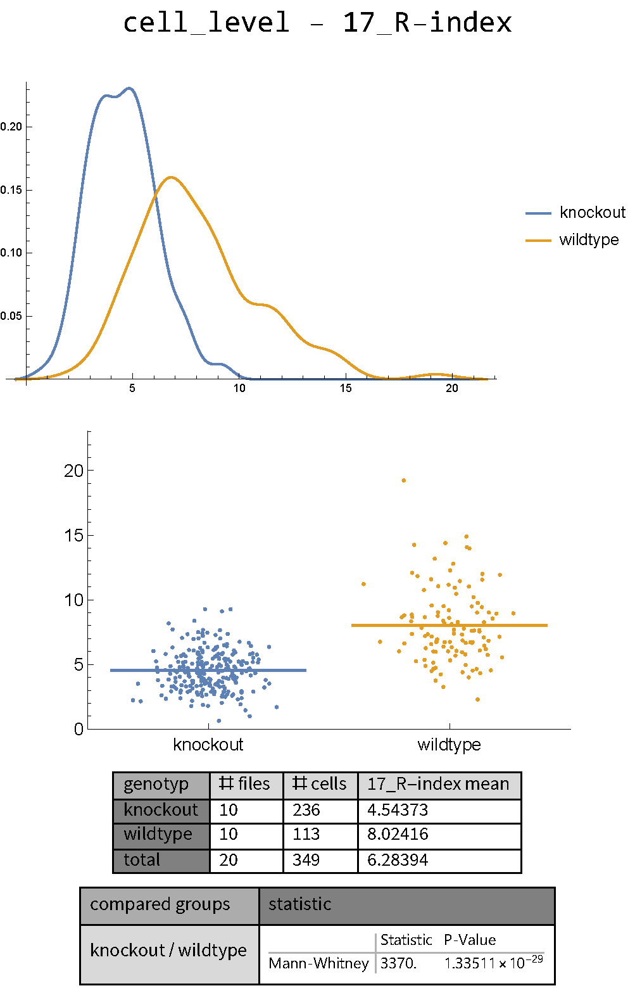
<figcaption>Example of the output PDF that shows the measurements of the
cell-level ZO-1 analysis</figcaption>
</figure>

##### File level PDF-files:

Like the cell level files but only the mean values from each image are
used – every image creates one data point. When a specific
’fileMeanCutoff’-value is defined, images with less cell objects are
excluded. The cut off value is also stated in the file name.

#### ZO-1 with single branch analysis

The single branch analysis outputs an object-level PDF-file showing the
visualized measurements and an excel file containing the raw data of the
R-index values. Other parameters are not collected. The cut off analysis
(see above) can also be applied to exclude values larger than the
predefined threshold, which might lead to a nicer visualization.
Negative values (are considered as modeling errors) are excluded for all
visualizations and in the raw data excel file.

#### ZO-1 with GFP processing

This setting generates an output very similar to the ZO-1 without single
branch and GFP functionality. The genotypes are not defined by the
folder structure since the files provide the GFP true or false
classification. File level analysis is not possible in this setting.

#### ZO-1 with both single branch and GFP processing

This analysis mode outputs multiple object-level PDF-files showing the
visualized measurements and excel files containing the raw data of the
R-index values, the branch orientation (only raw data excel file) and
the ’pulled area’ parameters. The cut off analysis (see above) can also
be applied to exclude values larger than the predefined threshold.
Negative values (are considered as modeling errors) are excluded for all
visualizations and in the raw data excel file. File level analysis is
not possible in this setting.

## Common errors

As described in previously the execution of the
Mathematica scripts is not error-free. In most cases it helps to
completely close and restart Mathematica and the script. Get the default
version of the script to avoid unknown changes in the source code in the
previously used one. Check the folder structure of the input data and if
the script has detected as many processing folders as expected (is
displayed when executing the third code block in the script). Sometime
only one excel file might be faulty and leads to an error message. If
doable check all input files to detect abnormalities in the table
structure.

# Acknowledgments

Thanks to all laboratory members who provided datasets for training,
testing and figure creation.

# Bibliography

[1] ComponentMeasurements. Wolfram Research. 2017. URL: https : / / reference . wolfram . com /
language/ref/ComponentMeasurements.html (visited on 12/17/2021).

[2] Falk, Thorsten. U-Net Segmentation Plugin für ImageJ. [online]. 2019. URL: https : / / sites .
imagej.net/Falk/plugins/ (visited on 08/01/2022).

[3] Falk, Thorsten et al. “U-Net. Deep learning for cell counting, detection, and morphometry”. eng. In:
Nature methods 16.1 (2019). Journal Article Research Support, Non-U.S. Gov’t, pp. 67–70. DOI:
10.1038/s41592-018-0261-2. eprint: 30559429.